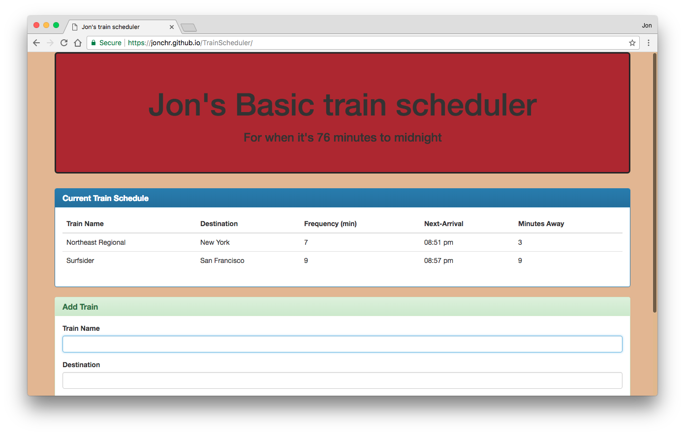
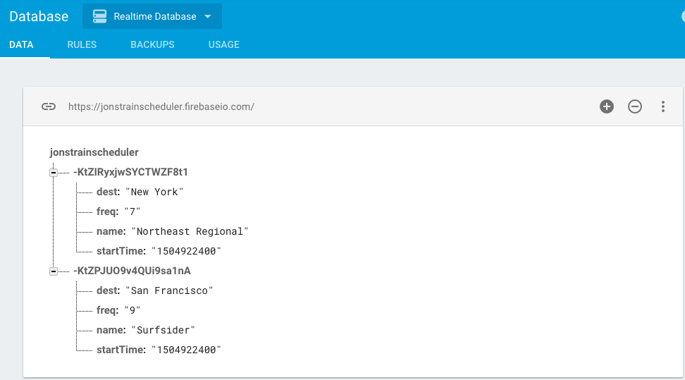

# TrainScheduler
This page stores train departure times in Firebase and displays the next departure using Moment.js. A live version can be viewed at https://jonchr.github.io/TrainScheduler

## Description

The train scheduler allows users to store train information in a Firebase database. The app remembers the name, destination, original departure time, and frequency of a train. It will then display the name, destination, frequency, next arrival time, and time to next arrival from the current time when the page is loaded. Time calculations were made using Moment.js.

### Development

This site was developed as part of the GW Coding Bootcamp and was completed during the fourth week. It was built using HTML5, CSS3 with Bootstrap v3.3.7, Javascript, and jQuery. It also featured Moment.js and Firebase. For more information on those last two, see http://momentjs.com/ and https://firebase.google.com/

### Organization

To run the game locally on your own computer, you can run the following in command line:

		git clone https://github.com/jonchr/TrainScheduler.git
		cd TrainScheduler
		open index.html

The HTML and CSS code is contained within index.html, while the Javascript and jQuery code is contained within the update.js file.

## Screenshots
### Main Page with two trains currently tracked

### Train Information Stored in Firebase

